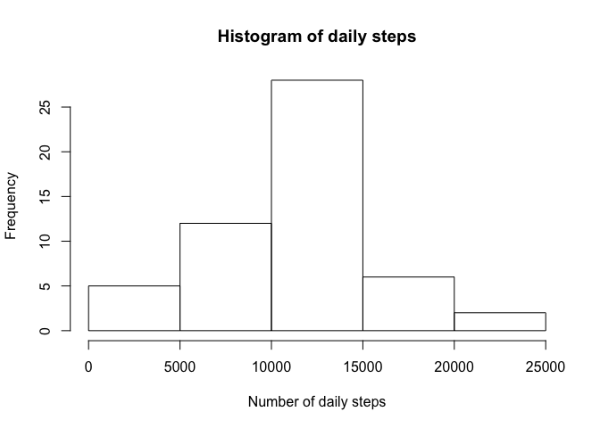
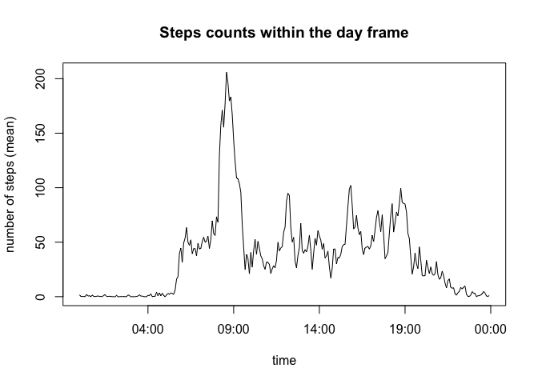
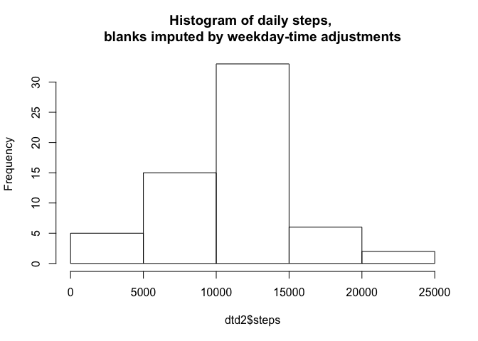
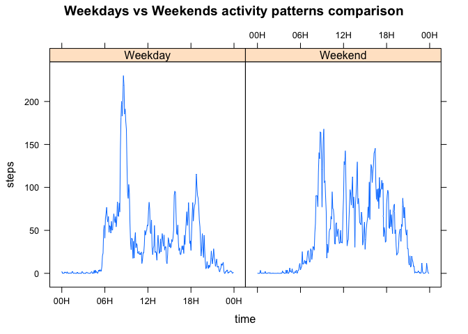

# Reproducible Research: Peer Assessment 1


## Loading and preprocessing the data

Firstly, unzip the data, read the input file and convert the date to standard format.


```r
unzip("activity.zip")
dt<-read.csv("activity.csv",stringsAsFactors = F)
dt$date<-as.Date(dt$date)
```

## What is mean total number of steps taken per day?

Now, let us aggregate the data by days and produce the visuals: histogram for total number of steps is as shown:


```r
dtd<-aggregate(steps~date,data=dt,FUN=sum, na.action=na.omit)
hist(dtd$steps,xlab="Number of daily steps",main ="Histogram of daily steps")
```

<!-- -->

The mean equals to 


```r
mean(dtd$steps)
```

```
## [1] 10766.19
```

The median = 


```r
median(dtd$steps)
```

```
## [1] 10765
```

## What is the average daily activity pattern?

Let us aggregate the data by intervals (interval variable in the dataset) and plot the daily beats:


```r
dtt<-aggregate(steps~interval,data=dt,FUN=mean, na.action=na.omit)
dtt$time<- as.POSIXct(paste('2017-01-01 ',dtt$interval%/%100,":",dtt$interval-100*dtt$interval%/%100,sep=""))
plot(x=dtt$time, y=dtt$steps,type="l",xlab="time",ylab="number of steps (mean)", main="Steps counts within the day frame")
```

<!-- -->

The most number of steps is recorded on the 5-minute interval, starting at 


```r
format(dtt$time[which(dtt$steps==max(dtt$steps))],"%I:%M")
```

```
## [1] "08:35"
```

## Imputing missing values

The total count of records with NA at "steps" variable equal to:

```r
sum(is.na(dt$steps))
```

```
## [1] 2304
```
We will try to use line smoothing of steps dayly dynamics with decomposition of each value to a product of weekday coefficient and the mean number of steps (adjusted for weekdays) for particular time interval:

```r
dt2<-dt
dt2$datetime<-as.POSIXct(paste(dt2$date, ' ',dt2$interval%/%100,":",dt2$interval-100*dt2$interval%/%100,sep=""))
dt2$wd<-format(dt2$datetime,"%a")#define the weekday
coeffs_wd<-aggregate(steps~wd, data=dt2,FUN=sum, na.action=na.omit)
coeffs_wd$value<-coeffs_wd$steps/mean(coeffs_wd$steps)#set of weekday relative steps intensity
dt2$coeffs_wd<-sapply(dt2$wd,function(wdi){coeffs_wd$value[which(coeffs_wd$wd==wdi)]})
dt2$steps_adj<-dt2$steps/dt2$coeffs_wd#steps count, adjusted for weekday
coeffs_hh<-aggregate(steps_adj~interval, data=dt2,FUN=mean, na.action=na.omit)#coefficients for each time interval
dt2$coeffs_hh<-sapply(dt2$interval,function(indi){coeffs_hh$steps_adj[which(coeffs_hh$interval==indi)]})
dt2$steps<-#put back the missing values: if value "is.na()", than we place the prpduct of weekday coefficient and 
           #average intensity for given time interval
  round(ifelse(!is.na(dt2$steps),dt2$steps,0)+ifelse(is.na(dt2$steps),dt2$coeffs_hh*dt2$coeffs_wd,0))
dt2<-dt2[,c("date","interval","steps")]
```

And compare the datasets:

```r
head(dt2,10)
```

```
##          date interval steps
## 1  2012-10-01        0     2
## 2  2012-10-01        5     0
## 3  2012-10-01       10     0
## 4  2012-10-01       15     0
## 5  2012-10-01       20     0
## 6  2012-10-01       25     2
## 7  2012-10-01       30     0
## 8  2012-10-01       35     1
## 9  2012-10-01       40     0
## 10 2012-10-01       45     1
```

```r
head(dt[,c('date','interval','steps')],10)
```

```
##          date interval steps
## 1  2012-10-01        0    NA
## 2  2012-10-01        5    NA
## 3  2012-10-01       10    NA
## 4  2012-10-01       15    NA
## 5  2012-10-01       20    NA
## 6  2012-10-01       25    NA
## 7  2012-10-01       30    NA
## 8  2012-10-01       35    NA
## 9  2012-10-01       40    NA
## 10 2012-10-01       45    NA
```

The histogram, mean and median for the adjusted set are:

```r
dtd2<-aggregate(steps~date,data=dt2,FUN=sum, na.action=na.omit)
hist(dtd2$steps,main="Histogram of daily steps, \nblanks imputed by weekday-time adjustments")
```

<!-- -->

The adjusted mean & median are shown below:


```r
mean(dtd2$steps)
```

```
## [1] 10753.23
```

```r
median(dtd2$steps)
```

```
## [1] 11015
```
As we can observe, mean value shift demonstrated to be not material, median appeared (unexpectedly) less robust and incresed by ~2.5%. The changes could be explained by,e.g. more weekend days were "unblanked", movingpushing upwards the mean & median.

## Are there differences in activity patterns between weekdays and weekends?

As in the section above, weekdays could be derived also with POSIX formatting/transforms:


```r
dt2$datetime<-as.POSIXct(paste(dt2$date, ' ',dt2$interval%/%100,":",dt2$interval-100*dt2$interval%/%100,sep=""))
dt2$time<- as.POSIXct(paste('2017-01-01 ',dt2$interval%/%100,":",dt2$interval-100*dt2$interval%/%100,sep=""))
dt2$daytype=ifelse(format(dt2$datetime,"%a")%in%c('Sun','Sat'),"Weekend","Weekday")
dt2wd<-aggregate(steps~daytype+time,data=dt2,FUN=mean)
library(lattice)
xyplot(steps~time|daytype,data=dt2wd,type='l',scales=list(x=list(format = "%HH")),
       main="Weekdays vs Weekends activity patterns comparison")
```

<!-- -->

So yes, as expected, on weekends people usually sleep longer, have no extreme rush at 8:30, but on average more mobile in daytime. 
